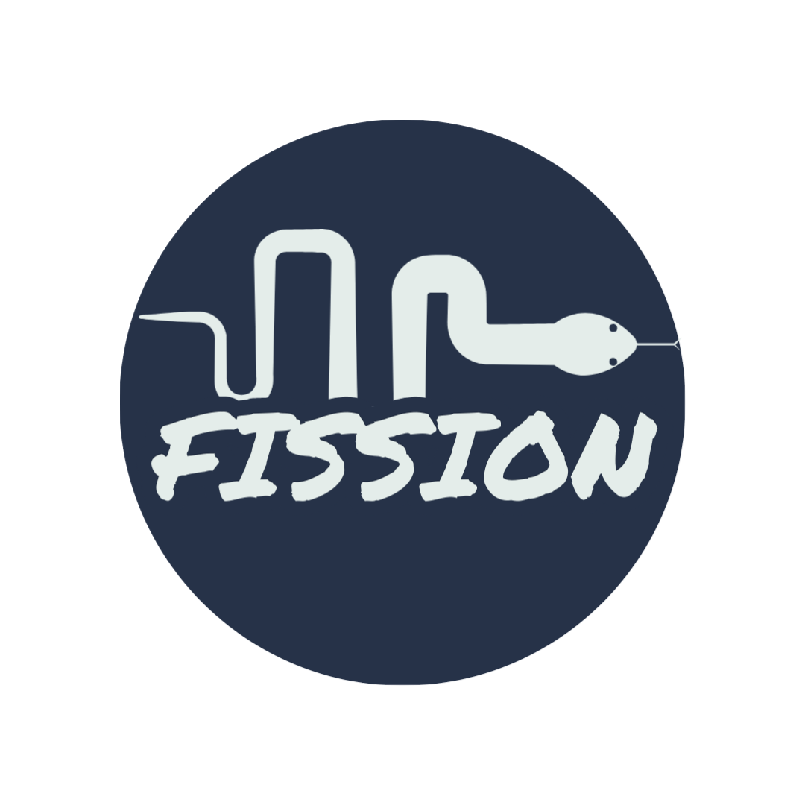

###  📝 Table of Contents

- [📝 Table of Contents](#table-of-contents )
- [🧐 About ](#about-a-name-abouta )
- [🏁 Getting Started ](#getting-started-a-name-getting_starteda )
- [🎈 Usage ](#usage-a-nameusagea )
- [🚀 Deployment ](#deployment-a-name-deploymenta )
- [⛏️ Built Using ](#️-built-using-a-name-built_usinga )

##  🧠About 

Fission is a fully featured network monitoring system written in python, powered by the Streamlit framework.

##  🏁 Getting Started 

Will update this section later...

##  🈠Usage 

Will update this section later...

##  🚀 Deployment 

Will update this section later...

##  ⛏️ Built Using 

- [Streamlit](https://streamlit.io/ ) - Web Framework
- [Python](https://python.org/ ) - Programming Language
- [Scrapli](https://github.com/carlmontanari/scrapli) - Network Automation Framework
- [Netmiko](https://github.com/ktbyers/netmiko) - Network Automation Framework
